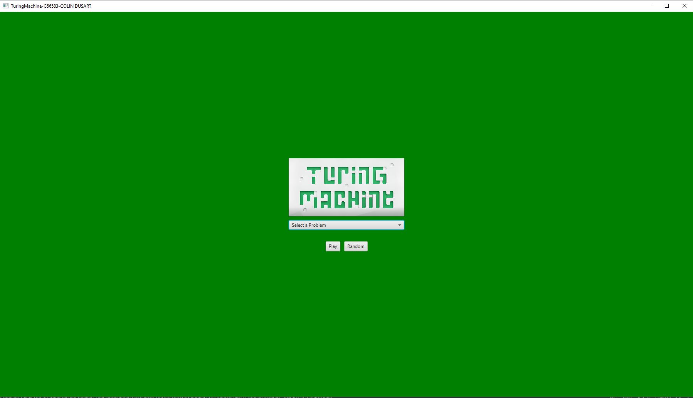
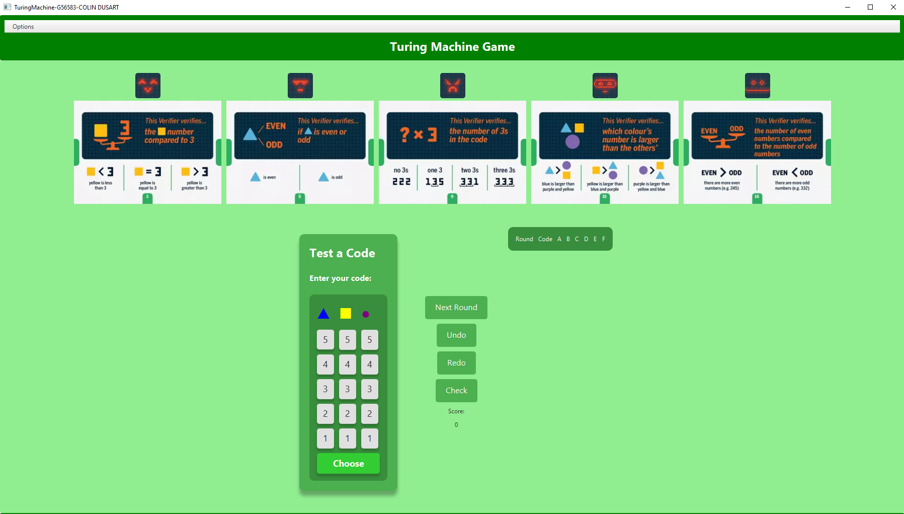
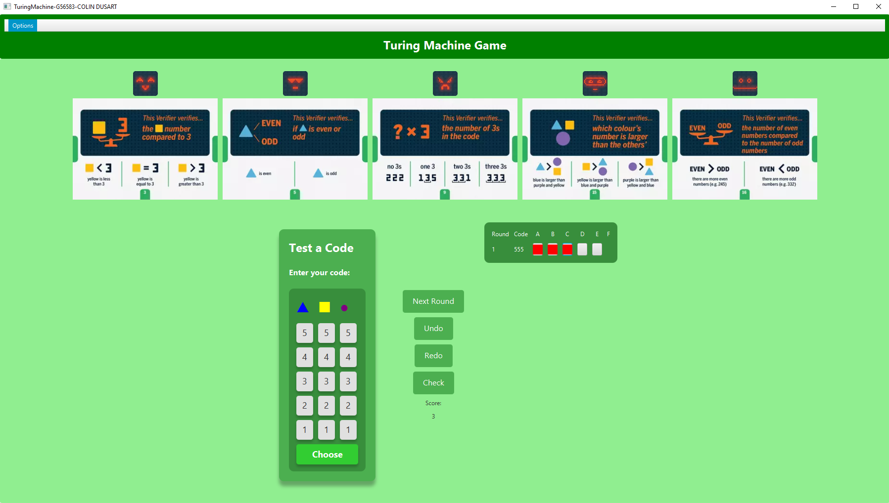

# Turing Machine Puzzle Game

## About the Project

The Turing Machine Puzzle Game is a JavaFX application that allows players to guess a secret code using a series of validators. The player interacts with the validators to receive feedback on their guesses. This project follows the MVC (Model-View-Controller) pattern and includes both console-based and graphical (JavaFX) interfaces for user interaction.

## Key Features

- Secret Code Generation: The game generates a random 3-digit secret code, each digit between 1 and 5.
- Validator Interaction: Players can select up to 3 validators per turn to receive feedback on their guessed code.
- Feedback System: Validators return either true (player's code fits the same category as the secret code) or false (does not fit).
- Game Rounds: The player makes guesses in multiple rounds and can attempt to guess the secret code at any time.
- Console & JavaFX Interfaces:
  - Console View: A text-based interface for code input, validator selection, and feedback display.
  - JavaFX View: A graphical interface allowing the player to interact with the game using buttons and input fields.
- Error Handling: Displays error messages for invalid inputs or if validators cannot be used.
- Undo/Redo Functionality: The player can undo or redo their previous actions.
-Score Display: Shows the player their current score, based on rounds and validator results.

## How to Run It

1. **Prerequisites:** Ensure you have Maven and JavaFX set up on your system.
2. **Open the project with IntelliJ IDEA.**
3. **Access the Maven window:** On the right panel, click on the Maven tab.
4. **Run the application:** Under the **JavaFX** section, double-click on javafx:run.
5. **The application should open.** with the graphical interface.

## Screenshots

